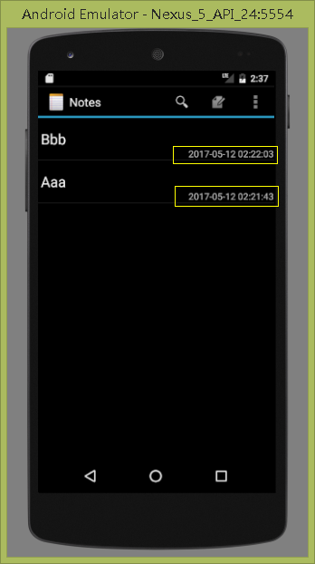
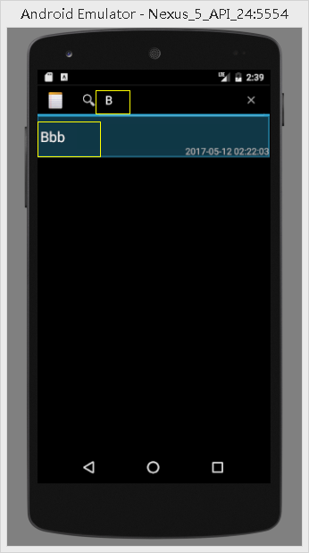

# NotePad

## 一、时间戳功能
1.在布局中增加显示时间戳的textview

> layout/noteslist_item.xml:

``` xml
<TextView
        android:layout_width="wrap_content"
        android:layout_height="?android:attr/listPreferredItemHeight"
        android:id="@+id/date"
        android:text="2017-04-26 20:20:20"
        android:layout_alignRight="@android:id/text1"
        android:paddingLeft="200dip"
        android:gravity="bottom"
        />
```
2.在NotesList的Activity中为投影增加一项时间戳
> NotesList:
``` xml
    private static final String[] PROJECTION = new String[] {
            NotePad.Notes._ID, // 0
            NotePad.Notes.COLUMN_NAME_TITLE, // 1
            NotePad.Notes.COLUMN_NAME_CREATE_DATE  //新增的时间戳项！
    };
```
3.修改适配器的相关参数的
>  NotesList:
``` 
        // Creates the backing adapter for the ListView.
       // SimpleCursorAdapter adapter
        adapter
            = new SimpleCursorAdapter(
                      this,                             // The Context for the ListView
                      R.layout.noteslist_item,          // Points to the XML for a list item
                      cursor,                           // The cursor to get items from
                      dataColumns            //这个投影的列的名字要增加一项
                      viewIDs                //同时绑定的控件的也要增加
              );
``` 
添加时间戳相对应的参数

``` 
        //String[] dataColumns = { NotePad.Notes.COLUMN_NAME_TITLE} ;
        String[] dataColumns = { NotePad.Notes.COLUMN_NAME_TITLE, NotePad.Notes.COLUMN_NAME_CREATE_DATE} ; 
		
        //int[] viewIDs = { android.R.id.text1};
	    int[] viewIDs = { android.R.id.text1, R.id.date};
```

> 效果


## 二、查询功能
1.在noteslist这个activity对应的菜单的xml文件中新增显示搜索栏的item
> list_options_menu.xml：

``` 
	//这是新增加的一个item
    <item android:id="@+id/menu_search"
        android:showAsAction="always"
        android:title="搜索" />
```
2,新定义一个全局变量来保存SearchView组件，把适配器弄成全局的变量

> NotesList:
``` 
    private SearchView searchView;
    //适配器
    private SimpleCursorAdapter adapter;
```
3.在函数中将SearchView绑定到对应的菜单上
 > NotesList -> public boolean onCreateOptionsMenu(Menu menu) 

``` stylus
    public boolean onCreateOptionsMenu(Menu menu) {
        // Inflate menu from XML resource
        MenuInflater inflater = getMenuInflater();
        inflater.inflate(R.menu.list_options_menu, menu);
		setSearchView(menu);  //为菜单新设置的SearchView组件
		...}
``` 
> setSearchView(menu)函数

``` stylus
    @TargetApi(Build.VERSION_CODES.ICE_CREAM_SANDWICH)
    private void setSearchView(Menu menu) {
        MenuItem menuItem = menu.getItem(0);
        searchView = new SearchView(this);
        menuItem.setActionView(searchView);

        searchView.setIconifiedByDefault(false);
        searchView.setQueryHint("搜索");
        searchView.onActionViewCollapsed();

        searchView.setOnQueryTextListener(new SearchView.OnQueryTextListener() {
            @TargetApi(Build.VERSION_CODES.ICE_CREAM_SANDWICH)
            @Override
            public boolean onQueryTextSubmit(String s) {
                searchView.onActionViewCollapsed();
                return false;
            }

            @Override
            public boolean onQueryTextChange(String newText) {
                if(!"".equals(newText)) {
                    //where条件
                    String selection = NotePad.Notes.COLUMN_NAME_TITLE +" like ?";
                    String[] args = new String[]{newText+"%"};//条件的参数
                    Cursor cursor = getContentResolver().query(getIntent().getData(),
                            PROJECTION,selection,args,null);
                    //重新绑定游标
                    adapter.swapCursor(null);
                    adapter.swapCursor(cursor);
                }
                return false;
            }
        });
    }
```
> 效果



